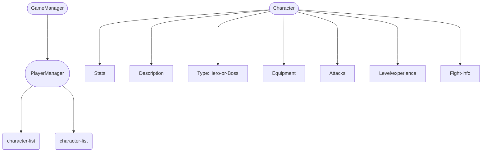

[status-img]: https://github.com/r0nd0ud0u/lib-rpg/actions/workflows/test.yml/badge.svg?branch=main
[status-url]: https://github.com/r0nd0ud0u/lib-rpg/actions/workflows/test.yml
[coverage-img]: https://img.shields.io/badge/Coverage-click--here-success?logo=github
[coverage-url]: https://r0nd0ud0u.github.io/lib-rpg/coverage/index.html

# Lib-RPG

[![Status][status-img]][status-url]
[![Coverage][coverage-img]][coverage-url]

This library defines the abstraction of the different functions to create a rpg game.

The different functions and object can be called separetely.
If you want to create a game from scratch, the entrypoint is the `GameManager`.

## Versions
- tag: 0.1.0 use  to call rust functions into cpp project
Example: https://github.com/r0nd0ud0u/qt-rpg/
- tag: from 1.0.0: cpp conversions not supported anymore, full rust interface 

## Description

## Offlines
Offlines are defining the game.
Some are written in json format.
- characters
- equipments
- attaks

Images are stored as well.

## Contributing
Issue -> PR
Use of clippy and fmt
Build: `cargo build`
Test: `cargo test unit`
Coverage: install tarpaulin `cargo install cargo-tarpaulin` and run `cargo tarpaulin --out Lcov -- unit_test`

