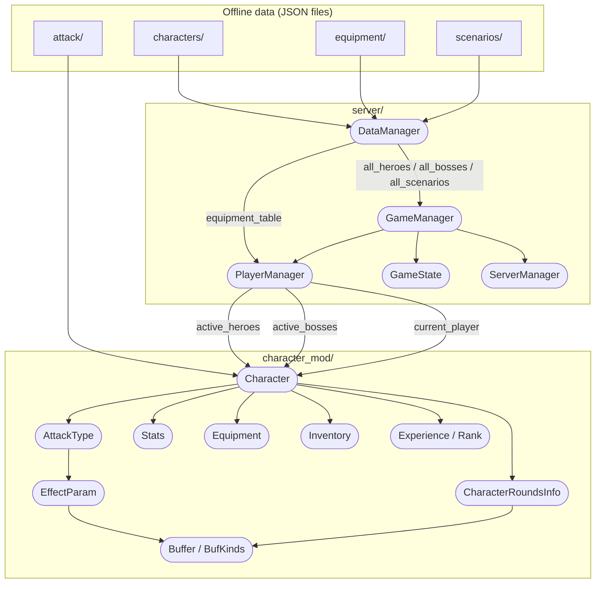
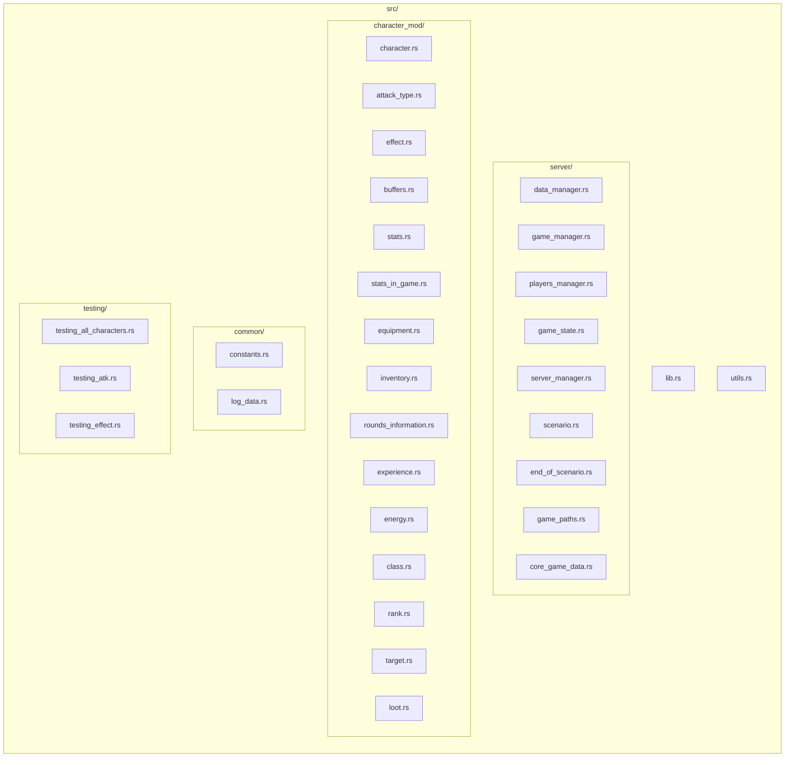
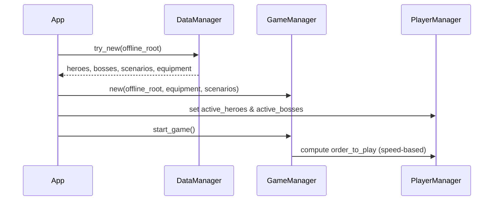
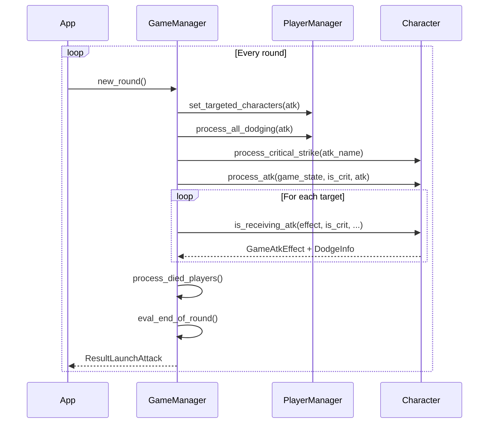
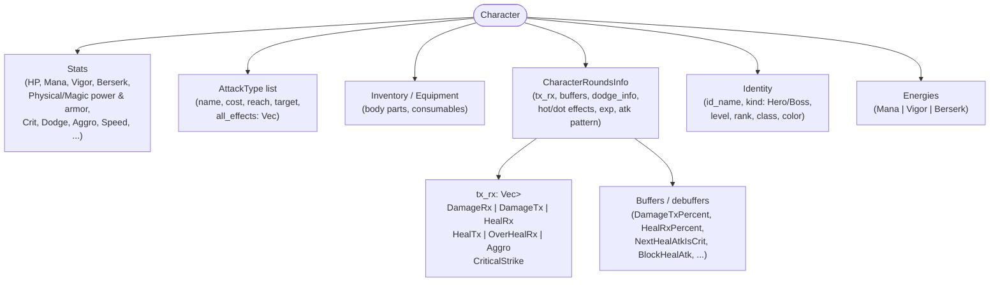

[status-img]: https://github.com/r0nd0ud0u/lib-rpg/actions/workflows/test.yml/badge.svg?branch=main
[status-url]: https://github.com/r0nd0ud0u/lib-rpg/actions/workflows/test.yml
[coverage-img]: https://img.shields.io/badge/Coverage-click--here-success?logo=github
[coverage-url]: https://r0nd0ud0u.github.io/lib-rpg/coverage/index.html

# Lib-RPG

[![Status][status-img]][status-url]
[![Coverage][coverage-img]][coverage-url]

Rust library providing the core engine for a turn-based RPG game. It manages characters, attacks, effects, equipment, experience, scenarios and game state. Designed to be called from a separate frontend (e.g. a Qt or web server).

## Versions

| Tag | Notes |
|-----|-------|
| 0.1.x | Exposes Rust functions callable from C++ (via FFI) |
| ≥ 1.0.0 | Pure Rust interface; C++ interop removed |

---

## Architecture overview

```mermaid
flowchart TB
    subgraph Offline data ["Offline data (JSON files)"]
        direction TB
        OC[characters/]
        OE[equipment/]
        OS[scenarios/]
        OA[attack/]
    end

    subgraph server ["server/"]
        DM([DataManager])
        GM([GameManager])
        PM([PlayerManager])
        GS([GameState])
        SM([ServerManager])
    end

    subgraph character_mod ["character_mod/"]
        CH([Character])
        ATK([AttackType])
        EFF([EffectParam])
        BUF([Buffer / BufKinds])
        STATS([Stats])
        EQ([Equipment])
        INV([Inventory])
        EXP([Experience / Rank])
        RI([CharacterRoundsInfo])
    end

    OC --> DM
    OE --> DM
    OS --> DM
    OA --> CH

    DM -->|all_heroes / all_bosses / all_scenarios| GM
    DM -->|equipment_table| PM
    GM --> PM
    GM --> GS
    GM --> SM

    PM -->|active_heroes| CH
    PM -->|active_bosses| CH
    PM -->|current_player| CH

    CH --> STATS
    CH --> ATK
    CH --> EQ
    CH --> INV
    CH --> EXP
    CH --> RI

    ATK --> EFF
    EFF --> BUF
    RI --> BUF
```

---

## Module structure

```mermaid
flowchart LR
    subgraph src ["src/"]
        LIB[lib.rs]
        UTILS[utils.rs]

        subgraph server ["server/"]
            DM2[data_manager.rs]
            GM2[game_manager.rs]
            PM2[players_manager.rs]
            GS2[game_state.rs]
            SM2[server_manager.rs]
            SC[scenario.rs]
            EOS[end_of_scenario.rs]
            GP[game_paths.rs]
            CGD[core_game_data.rs]
        end

        subgraph character_mod ["character_mod/"]
            CH2[character.rs]
            ATK2[attack_type.rs]
            EFF2[effect.rs]
            BUF2[buffers.rs]
            ST2[stats.rs]
            SIG2[stats_in_game.rs]
            EQ2[equipment.rs]
            INV2[inventory.rs]
            RI2[rounds_information.rs]
            EXP2[experience.rs]
            EN2[energy.rs]
            CL2[class.rs]
            RK2[rank.rs]
            TG2[target.rs]
            LT2[loot.rs]
        end

        subgraph common ["common/"]
            CONST[constants.rs]
            LOG[log_data.rs]
        end

        subgraph testing ["testing/"]
            TALL[testing_all_characters.rs]
            TATK[testing_atk.rs]
            TEFF[testing_effect.rs]
        end
    end
```

---

## Game flow

### Initialization

```mermaid
sequenceDiagram
    participant App
    participant DataManager
    participant GameManager
    participant PlayerManager

    App->>DataManager: try_new(offline_root)
    DataManager-->>App: heroes, bosses, scenarios, equipment

    App->>GameManager: new(offline_root, equipment, scenarios)
    App->>PlayerManager: set active_heroes & active_bosses
    App->>GameManager: start_game()
    GameManager->>PlayerManager: compute order_to_play (speed-based)
```

### Turn loop

```mermaid
sequenceDiagram
    participant App
    participant GameManager
    participant PlayerManager
    participant Character

    loop Every round
        App->>GameManager: new_round()
        GameManager->>PlayerManager: set_targeted_characters(atk)
        GameManager->>PlayerManager: process_all_dodging(atk)
        GameManager->>Character: process_critical_strike(atk_name)
        GameManager->>Character: process_atk(game_state, is_crit, atk)
        loop For each target
            GameManager->>Character: is_receiving_atk(effect, is_crit, ...)
            Character-->>GameManager: GameAtkEffect + DodgeInfo
        end
        GameManager->>GameManager: process_died_players()
        GameManager->>GameManager: eval_end_of_round()
        GameManager-->>App: ResultLaunchAttack
    end
```

---

## Character anatomy

```mermaid
flowchart TB
    Character([Character])

    Character --> Stats["Stats\n(HP, Mana, Vigor, Berserk,\nPhysical/Magic power & armor,\nCrit, Dodge, Aggro, Speed, ...)"]
    Character --> Attacks["AttackType list\n(name, cost, reach, target,\nall_effects: Vec<EffectParam>)"]
    Character --> Equipment["Inventory / Equipment\n(body parts, consumables)"]
    Character --> RoundsInfo["CharacterRoundsInfo\n(tx_rx, buffers, dodge_info,\nhot/dot effects, exp, atk pattern)"]
    Character --> Identity["Identity\n(id_name, kind: Hero/Boss,\nlevel, rank, class, color)"]
    Character --> Energies["Energies\n(Mana | Vigor | Berserk)"]

    RoundsInfo --> TxRx["tx_rx: Vec<HashMap<turn, value>>\nDamageRx | DamageTx | HealRx\nHealTx | OverHealRx | Aggro\nCriticalStrike"]
    RoundsInfo --> Buffers["Buffers / debuffers\n(DamageTxPercent, HealRxPercent,\nNextHealAtkIsCrit, BlockHealAtk, ...)"]
```

---

## Offline data (JSON)

| Directory | Content |
|-----------|---------|
| `offlines/characters/` | One JSON per character (heroes & bosses) |
| `offlines/attack/<CharacterName>/` | One JSON per attack for that character |
| `offlines/equipment/body/` | Equipment definitions |
| `offlines/equipment/characters/` | Character-specific equipment assignments |
| `offlines/scenarios/` | Scenario definitions (boss patterns, loots, level) |

---

## Contributing

- Issue → PR
- Use `cargo fmt` and `cargo clippy` before committing
- Build: `cargo build`
- Test: `cargo test unit`
- Coverage:
  - install tarpaulin: `cargo install cargo-tarpaulin`
  - run: `cargo tarpaulin --out Lcov -- unit`

