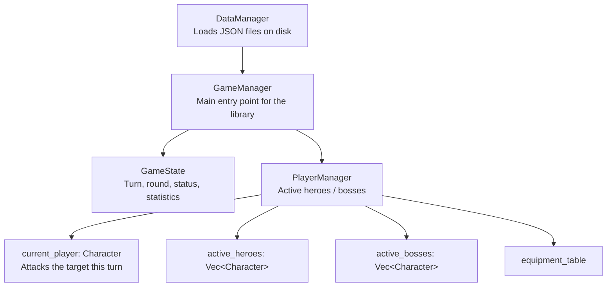
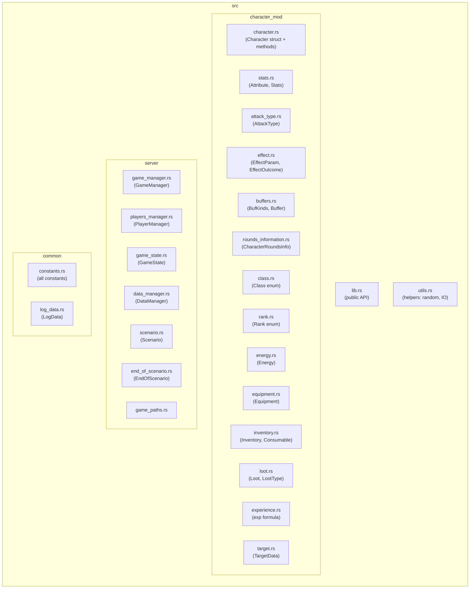
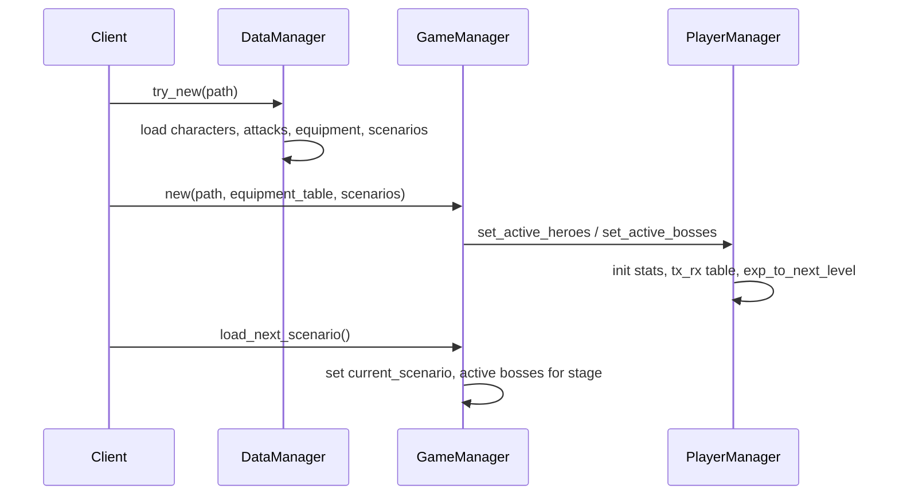
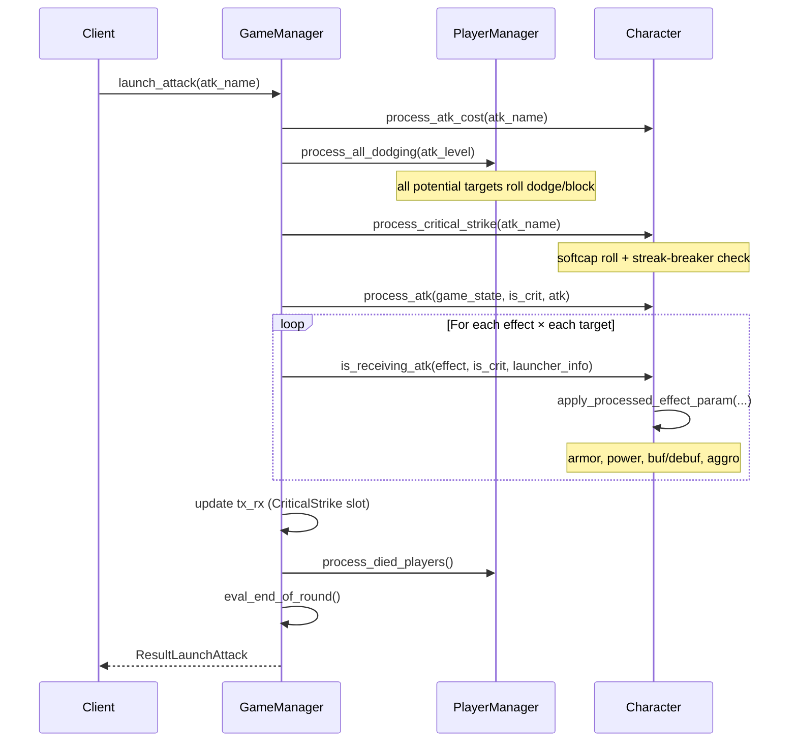
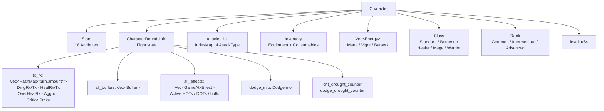
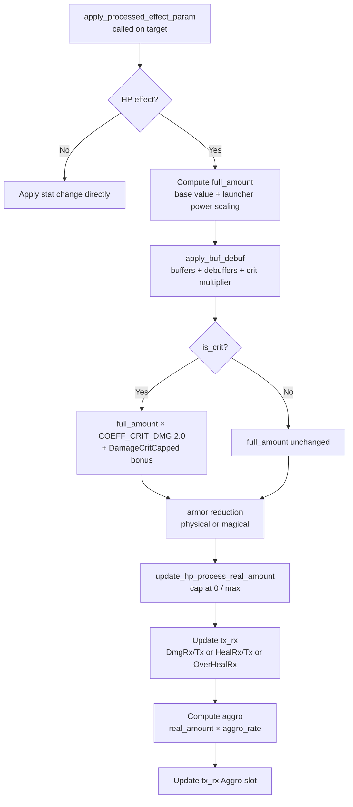
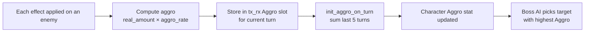

# lib-rpg — Architecture & Game Mechanics

## Table of Contents

1. [High-level architecture](#high-level-architecture)
2. [Module structure](#module-structure)
3. [Offline data layout](#offline-data-layout)
4. [Game flow](#game-flow)
5. [Character anatomy](#character-anatomy)
6. [Stats system](#stats-system)
7. [Attack flow & damage calculation](#attack-flow--damage-calculation)
8. [Critical strike system](#critical-strike-system)
9. [Dodge & block system](#dodge--block-system)
10. [Effects, HOTs & DOTs](#effects-hots--dots)
11. [Buffers & debuffers](#buffers--debuffers)
12. [Aggro system](#aggro-system)
13. [Experience & level-up](#experience--level-up)
14. [Equipment](#equipment)

---

## High-level architecture



The client calls `GameManager` exclusively. `DataManager` is only called during initialisation.

---

## Module structure



---

## Offline data layout

All game data lives under `offlines/` and is loaded from JSON by `DataManager`.

| Folder | Content |
|---|---|
| `offlines/characters/` | One `.json` per character (heroes and bosses) |
| `offlines/attack/<CharacterName>/` | One `.json` per attack for that character |
| `offlines/equipment/body/` | Equipment items |
| `offlines/equipment/characters/` | Equipment pre-assigned to characters |
| `offlines/scenarios/` | Scenario files (`stage_1.json`, …) |

---

## Game flow

### Initialisation



### Turn loop



---

## Character anatomy



---

## Stats system

Each character has 18 stats stored in an `IndexMap<String, Attribute>`:

| Stat name | Role |
|---|---|
| `HP` | Hit points |
| `Mana` | Mana resource |
| `Vigor` | Vigor resource |
| `Berserk` | Berserk resource |
| `Physical armor` | Reduces incoming physical damage |
| `Magic armor` | Reduces incoming magical damage |
| `Physical power` | Boosts outgoing physical damage |
| `Magic power` | Boosts outgoing magical damage |
| `Aggro` | Threat accumulation (last 5 turns, see NB_TURN_SUM_AGGRO) |
| `Speed` | Determines turn order; consumes SPEED_THRESHOLD (100) per turn |
| `Critical strike` | Raw stat fed into the softcap formula |
| `Dodge` | Raw stat fed into the softcap formula |
| `HP regeneration` | Passive HP restored per round |
| `Mana regeneration` | Passive Mana restored per round |
| `Vigor regeneration` | Passive Vigor restored per round |
| `Berserk rate` | Rate at which Berserk fills |
| `Aggro rate` | Multiplier on generated aggro |
| `Speed regeneration` | Speed restored per round |

Each `Attribute` tracks:

```
current = max_raw + equip_value + equip_percent×max_raw/100
                  + buf_effect_value + buf_effect_percent×max_raw/100
```

Stats that scale on level-up (10 % of `max_raw`): HP, Mana, Vigor, Physical/Magic power, Physical/Magic armor, Speed.

---

## Attack flow & damage calculation



### Armor reduction formula

$$\text{real damage} = \text{full damage} \times \frac{1000}{1000 + \text{armor}}$$

This gives a soft reduction: armor=1000 → 50 %, armor=3000 → 25 %.

### Power scaling (HP effects only)

$$\text{full amount} = \text{base value} + \frac{\text{launcher power}}{\text{nb turns}}$$

where `launcher_power` is `Physical power` for physical attacks and `Magic power` for magical attacks.

---

## Critical strike system

### Probability — hyperbolic softcap

Raw `Critical strike` stat is converted to an effective percentage using a softcap:

$$P_{\text{crit}} = \frac{\text{stat}}{100 + \text{stat}} \times 100$$

| Raw stat | Effective chance |
|---|---|
| 10 | ≈ 9 % |
| 30 | ≈ 23 % |
| 60 | ≈ 38 % |
| 100 | 50 % |
| 200 | ≈ 67 % |

This prevents hard-capping at a specific value while allowing high investment to still matter.

### Excess stat → DamageCritCapped bonus

If `raw_stat > 60`, the excess converts into an additive bonus on top of the base crit multiplier:

```
delta = raw_stat − 60
effective_crit_multiplier = COEFF_CRIT_DMG (2.0) + delta
```

So a character with stat=80 crits at `×2.0 + 20 = ×22.0` (the multiplier, not the bonus — the delta value is small by design).

### Priority order for a crit to fire

1. **Passive `NextHealAtkIsCrit`** — fires unconditionally on the next heal-only attack when `is_passive_enabled = true`. Disables the passive once consumed.
2. **Streak-breaker** — if the drought counter ≥ threshold, the crit is guaranteed (see below).
3. **Dice roll** — `rand(1..=100) ≤ P_crit`.

If none fire, `crit_drought_counter` increments by 1.

### Streak-breaker

Prevents frustrating long dry spells. After `N` consecutive turns without a crit, the next one is guaranteed.

| Activation condition | Default threshold N |
|---|---|
| `StreakBreakerCrit` buffer active (set by any effect) | buffer's `value` field |
| `Class::Berserker` | 3 turns |
| `Rank::Advanced` AND `level ≥ 5` | 5 turns |
| `Rank::Intermediate` AND `level ≥ 10` | 8 turns |

Precedence: buffer > class > rank. If none match, the streak-breaker is disabled.

An attack or equipment effect can enable/tune the streak-breaker by applying a `StreakBreakerCrit` buffer (via `BufKinds::StreakBreakerCrit`) with `value` = desired threshold.

---

## Dodge & block system

### Dodge probability — same softcap

$$P_{\text{dodge}} = \frac{\text{Dodge stat}}{100 + \text{Dodge stat}} \times 100$$

### Class behaviour

| Class | On dodge condition met |
|---|---|
| Standard / Healer / Mage / Warrior | **Dodges** — attack has no effect |
| Berserker | Always **blocks** — takes 10 % of the intended damage |

Ultimate-level attacks (`level = ULTIMATE_LEVEL = 13`) can never be dodged or blocked.

### Streak-breaker (dodge)

Same mechanism as crit. Counter increments on each non-dodge. Berserkers are excluded (they never truly dodge, they always block).

| Activation condition | Default threshold N |
|---|---|
| `StreakBreakerDodge` buffer active | buffer's `value` field |
| `Rank::Advanced` AND `level ≥ 5` | 5 turns |
| `Rank::Intermediate` AND `level ≥ 10` | 8 turns |

---

## Effects, HOTs & DOTs

An `EffectParam` defines:

| Field | Meaning |
|---|---|
| `nb_turns` | Duration; 1 = instant effect only |
| `buffer.kind` | What the effect does (see `BufKinds`) |
| `buffer.value` | Magnitude |
| `buffer.stats_name` | Which stat is affected (e.g. `"HP"`) |
| `target_kind` | `"Ennemie"` or `"Allié"` |
| `reach` | `"Individuel"` or `"Zone"` |
| `is_magic_atk` | Selects which power stat scales the damage |

HOT/DOT effects use `BufKinds` of type:
- `ChangeCurrentStatByValue` — absolute value change each turn
- `ChangeCurrentStatByPercentage` — percentage of max stat each turn
- `DecreasingRateOnTurn` — success rate decreases each turn
- `RepeatAsManyAsPossible` — applies as many times as possible

Processing rules:
- An effect launched on turn `T` starts ticking on turn `T+1`.
- `counter_turn` increments each turn; effect expires when `counter_turn == nb_turns`.
- `process_hot_and_dot()` runs at the start of each turn and returns the total amount to apply as HP change.

---

## Buffers & debuffers

A `Buffer` has `kind: BufKinds`, `value: i64`, `is_percent: bool`, and optional `stats_name`.

Key `BufKinds` and their roles:

| Kind | Role |
|---|---|
| `DamageTxPercent` | Increases outgoing damage by % |
| `DamageRxPercent` | Increases incoming damage taken by % |
| `HealTxPercent` | Increases outgoing heal by % |
| `HealRxPercent` | Increases incoming heal by % |
| `DamageCritCapped` | Bonus crit multiplier for excess crit stat above 60 |
| `NextHealAtkIsCrit` | Passive: next heal attack is guaranteed critical |
| `MultiValue` | Multiplies heal output |
| `BoostedByHots` | Heal boosted by active HOTs |
| `ChangeCurrentStatByValue` | Directly modifies a stat's current value |
| `ChangeMaxStatByValue` | Modifies a stat's max (adjusts current by ratio) |
| `ChangeMaxStatByPercentage` | Same but by % |
| `BlockHealAtk` | Prevents the target from receiving heals |
| `CooldownTurnsNumber` | Puts an attack on cooldown |
| `StreakBreakerCrit` | Enables/tunes crit streak-breaker (value = threshold) |
| `StreakBreakerDodge` | Enables/tunes dodge streak-breaker (value = threshold) |
| `IsDamageTxHealNeedyAlly` | Converts TX damage into heals on the most-wounded ally |
| `ApplyEffectInit` | Stores the number of times an effect repeats |
| `DecreasingRateOnTurn` | Decreasing success-rate HOT/DOT |

Buffers on `CharacterRoundsInfo.all_buffers` are accumulated with `update_buffer()` (same kind → value accumulates; new kind → appended).

---

## Aggro system

Aggro determines which character is preferentially targeted by boss AIs.



`NB_TURN_SUM_AGGRO = 5`: only the last 5 turns contribute to the aggro total. This prevents old, inactive characters from holding aggro indefinitely.

---

## Experience & level-up

Experience needed for the next level is calculated by `build_exp_to_next_level(rank, class, level)`.

On level-up:
1. All stats in `STATS_TO_LEVEL_UP` increase by 10 % of `max_raw`.
2. `exp_to_next_level` is recomputed for the new level.
3. Any excess experience carries over.

---

## Equipment

Equipment applies stat bonuses tracked separately from effect buffers:
- `buf_equip_value` — flat bonus from equipment
- `buf_equip_percent` — percentage bonus from equipment

This separation means equipment bonuses are applied at load time and survive effect resets, while in-fight buffers (from effects) are managed independently.

Equipment can be assigned per character in `offlines/equipment/characters/` or looted at the end of a scenario based on the hero's class.
